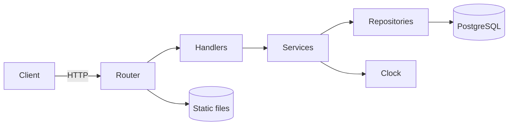
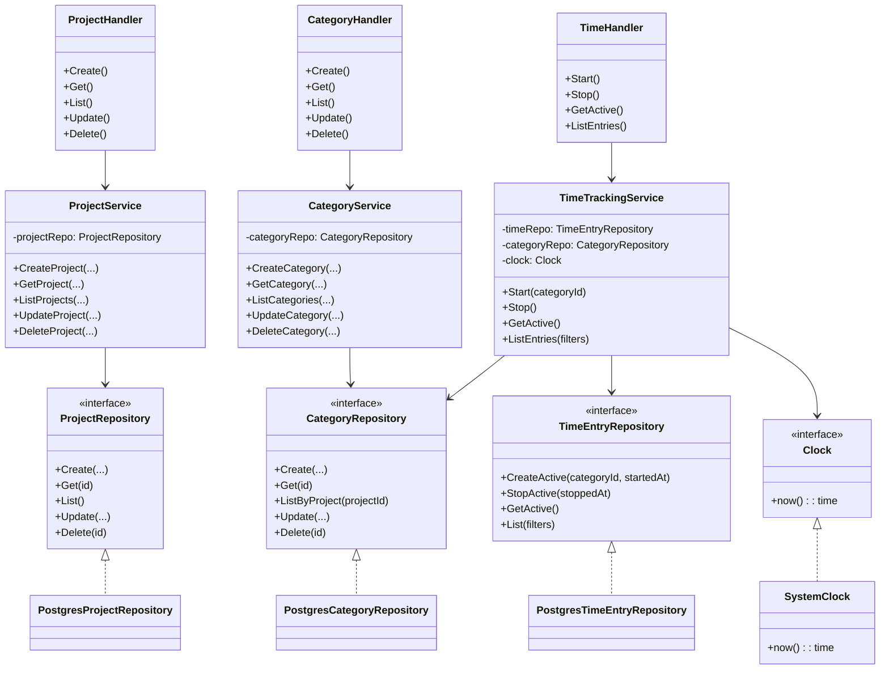
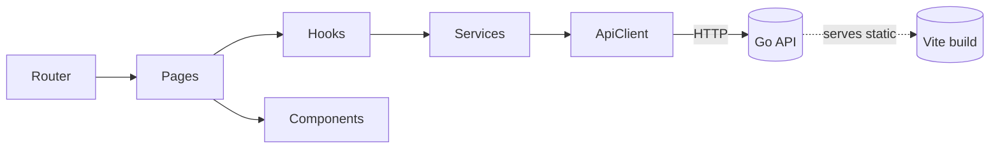
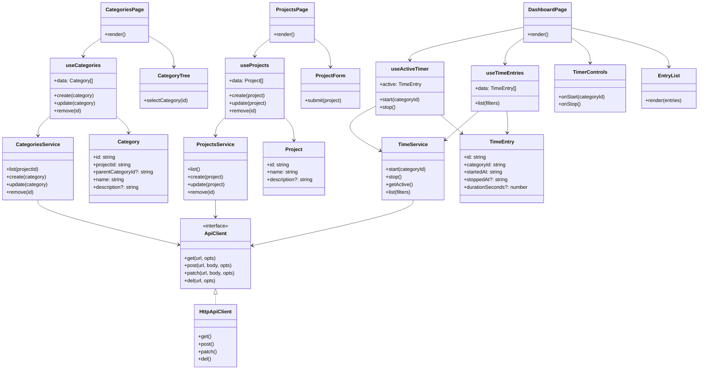

# Architecture

## High-level design
- Client–server architecture
  - Client: Vite + React SPA compiled to static assets
  - Server: Go HTTP API and static file server (serves client in production)
- Production target: Kubernetes
  - One service/pod for the Go server
  - PostgreSQL database for projects, categories, and time entries

## Repository layout (proposed)
```
/ client        # TypeScript web client (SPA)
/ server        # Go backend (HTTP API, static file server in prod)
/ deploy        # Kubernetes manifests, Helm chart, or Kustomize overlays
/ docs          # Project documentation
```

## Notes
- The server will expose REST endpoints and enforce the single-active-timer invariant
- Static client assets are served by the Go server in production deployments
 - PostgreSQL is the primary data store; prefer managed Postgres in production

## Server modules (proposed overview)
- cmd/server
  - Program entrypoint, wiring of configuration, router, handlers, services, repositories
- internal/config
  - Loads env/config (e.g., PORT, DATABASE_URL), validates and exposes typed config
- internal/http
  - Router setup, middleware (logging, recover, request id, CORS), and route registration
  - Handlers:
    - ProjectHandler (CRUD)
    - CategoryHandler (CRUD)
    - TimeHandler (start/stop/active/list)
- internal/service
  - ProjectService, CategoryService, TimeTrackingService (domain logic, invariants)
  - Depends on repositories and a clock abstraction for testability
- internal/repository
  - Interfaces: ProjectRepository, CategoryRepository, TimeEntryRepository
  - PostgreSQL implementations using database/sql or a lightweight ORM
- internal/db
  - PostgreSQL connection management and migrations
- internal/domain
  - Core domain types: Project, Category, TimeEntry
- internal/clock
  - Clock interface and SystemClock implementation (enables deterministic tests)

High-level request flow:


## Server class diagram (services, repositories, handlers)


Notes:
- Handlers are thin: they validate/parse requests and delegate to services
- Services contain invariants (e.g., single active timer) and transactional boundaries
- Repositories encapsulate all database access; implementations use PostgreSQL

## Client modules (proposed overview)
- client/src/app
  - App shell, router, global providers (theme, error boundary)
- client/src/pages
  - Route-level views: ProjectsPage, CategoriesPage, DashboardPage
- client/src/components
  - Reusable presentational components: TimerControls, CategoryTree, EntryList, ProjectForm
- client/src/features
  - Feature-scoped components and hooks: projects, categories, time
- client/src/api
  - API client, endpoint wrappers, HTTP helpers, request/response typing
- client/src/services
  - Thin services orchestrating calls across API modules (optional layer)
- client/src/hooks
  - Custom hooks: useProjects, useCategories, useActiveTimer, useTimeEntries
- client/src/types
  - Shared TypeScript types/interfaces (Project, Category, TimeEntry)
- client/src/utils
  - Utilities (formatting, date/time helpers)
- client/public
  - Static assets served by Vite

High-level client flow:


## Client class diagram (components, hooks, services, API)


Notes:
- Pages are route-level containers that compose presentational components and call hooks
- Hooks encapsulate data fetching/mutations and state derived from services
- Services coordinate API calls; they are thin to keep logic testable and reusable
- ApiClient centralizes HTTP concerns (base URL, headers, error handling)

