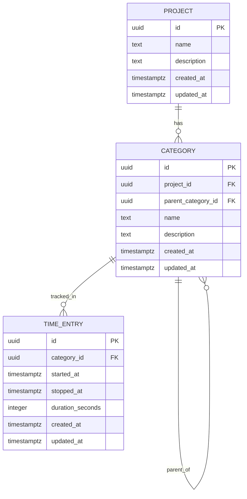

# Domain model

## Entities
- Project
  - id, name, description?
  - has many categories
- Category
  - id, projectId, name, description?
  - parentCategoryId? (hierarchical tree)
  - cannot be reassigned to a different project after creation
- TimeEntry
  - id, categoryId, startedAt, stoppedAt?, durationSeconds? (derived when stopped)

## Invariants and rules
- Only one active TimeEntry at a time (per user in MVP)
- Categories form a tree within a project
- Time is tracked only on categories

### Service-enforced behavior
- Categories:
  - Parent category must belong to the same project as the child
  - No cycles in the tree: a category’s parent cannot be itself or any of its descendants
  - Project of a category is immutable (no cross-project moves)
- Time tracking:
  - Starting a timer auto-stops any previously active entry using the same timestamp for `stoppedAt` and the new entry’s `startedAt`
  - Duration is computed on stop as `seconds(now - startedAt)` and clamped to be non-negative
  - All time decisions are sourced from a `clock.Clock` to enable deterministic tests

## Database schema (UML/ER)

### Constraints and indexes (PostgreSQL)
- `CATEGORY.project_id` → FK to `PROJECT.id` (ON DELETE RESTRICT)
- `CATEGORY.parent_category_id` → FK to `CATEGORY.id` (nullable, ON DELETE SET NULL)
- `TIME_ENTRY.category_id` → FK to `CATEGORY.id` (ON DELETE RESTRICT)
- Unique recommendation: `(project_id, name)` on `CATEGORY` to prevent duplicate names within a project
- Indexes: `CATEGORY(project_id)`, `CATEGORY(parent_category_id)`, `TIME_ENTRY(category_id, started_at)`
- Invariant enforcement (single active timer) at application level; optional partial index to help queries:
  - `CREATE INDEX ON time_entry (category_id) WHERE stopped_at IS NULL;`

